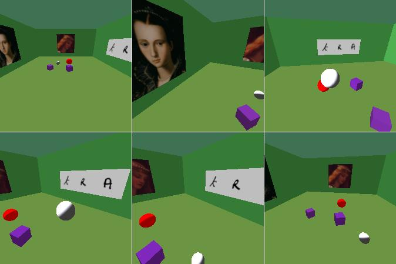

# JEPAWorld Usage Guide

This repository contains the **MiniWorld-based `RearrangeOneRoom` environment** along with helper utilities and a policy for collecting trajectories. The most relevant code can be found in:

- `Miniworld/miniworld/envs/jeparoom.py` – defines the `RearrangeOneRoom-v0` environment used for data collection.
- `policies/helpers.py` – helper dataclasses and functions for constructing a PRM and saving datasets.
- `policies/rearrange.py` – contains `HumanLikeRearrangePolicy` used to generate actions.
- `scripts/collect_trajectories.py` – script that instantiates the environment and policy to record trajectories.
- `notebooks/01_data_inspection.ipynb` - jupyter notebook for data inspection, sanity checks and training preparation.

---

## Environment

The environment is implemented in `Miniworld/miniworld/envs/jeparoom.py`, where the class `RearrangeOneRoom-v0` inherits from `MiniWorldEnv`. It creates a single rectangular room with randomized elements:

```python
class RearrangeOneRoom-v0(MiniWorldEnv, utils.EzPickle):
    """
    Single-room environment with randomized wall, floor, ceiling colors,
    and randomly placed objects (balls, boxes, keys) that are visually distinguishable.
    """
```

The `_gen_world()` method uses `add_rect_room` to build the layout and place objects. Example visuals:




---

## Helpers and Policy

The file `policies/helpers.py` defines lightweight dataclasses:

- `Room`, `Obstacle`, `GraphData`
- Functions like `get_graph_data` and `build_prm_graph_single_room` to construct Probabilistic Roadmaps (PRMs)

The core policy in `policies/rearrange.py` is `HumanLikeRearrangePolicy`, which plans and performs a series of **pick-and-place** operations, relying on PRM-based path planning.

---

## Collecting Trajectories

The trajectory collection is controlled by `scripts/collect_trajectories.py`, where the `CollectTrajectories` class allows you to define:

- n_episodes,
- save_images (saves Images insted of .npy)
- overwrite (overrides existing episodes)
- base_seed=0

**Installation Steps**:

```bash
python -m venv .venv
source .venv/bin/activate  
pip install -r requirements.txt
cd Miniworld
pip install -e .
cd ..
```

**Start data collection** by setting the output directory in `collect_trajectories.py`, then:

```bash
source .venv/bin/activate  
python scripts/collect_trajectories.py
```

Customize trajectory collection by editing the `CollectTrajectories` instantiation (e.g., `n_episodes`, `save_images`, etc.).

> 💡 On **macOS**, set `n_samples <= 40000` per run to avoid pyglet issues. The script supports resumable collection — appending new episodes automatically.

---

## Manual Inspection (Keyboard Control)

Use keyboard input to manually explore the environment:

```bash
source .venv/bin/activate  
python Miniworld/scripts/manual_control.py --env-name RearrangeOneRoom-v0 --domain-rand
```

---

## License and Contact

This project is released under the **MIT License**.

For questions, suggestions, or collaboration inquiries, please contact:

📧 **Julian Quast**  
`julian.quast@campus.tu-berlin.de`
